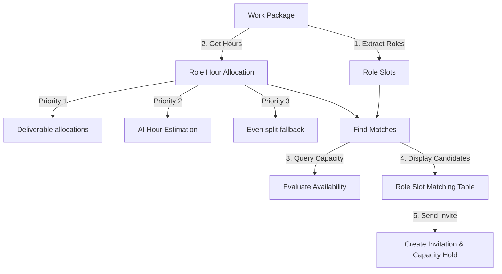

# Section 4.2: AI Matchmaking Suggestions

ABRAM features an advanced, AI-powered project matchmaking system designed to suggest the optimal crew members for your projects. Instead of searching and reviewing profiles manually, the matchmaking engine automatically analyzes project requirements and compares them against your team's real-time availability, skills, portfolio experience, budget, and working preferences.

---

## 1. The Matching Workflow

The matchmaking engine works on a per-role basis to compile optimal crew suggestions:

### 1. Splitting into Role Slots

A project’s work package is broken down into individual **Role Slots** (e.g., _Cinematographer_, _Gaffer_, _Key Grip_). Each role slot has a defined start date, end date, and required skills.

### 2. The Hours Allocation Priority Chain

Before matching, the engine assigns specific effort hours to each role slot based on a strict priority chain to determine how much work is required:

- **Deliverable Explicit Allocations (Priority 1 - Free)**: The system first checks the deliverables linked to the work package. If you have explicitly assigned hours to specific roles within those deliverables (e.g., _Editor: 15 hours_, _Colorist: 5 hours_), the system sums these amounts. This is the source of truth, is completely free, and does not consume AI credits.
- **AI Estimation (Priority 2 - Credit Gated)**: If no explicit allocations are defined, the AI Assistant estimates role-specific hours based on the project scope. To protect your credits, the AI automatically saves (caches) these estimations back to the first deliverable of the project. This ensures that you only pay for the AI estimation once, rather than on every page refresh or search update.
- **Even Split Fallback (Priority 3 - Free)**: If explicit and AI allocations are unavailable (for example, if the AI service is offline or your workspace credits are depleted), the system divides the work package's total estimated hours evenly among the active roles (e.g., 30 hours split among 3 roles gets 10 hours each).

### 3. Effort Hours to Weekly Capacity Conversion

Once the total effort hours are determined, they are converted into a **weekly planned capacity hold** for scheduling:

- **Short Projects (1 week or less)**: The weekly capacity hold is equal to the total effort hours.
- **Long Projects (more than 1 week)**: The weekly capacity hold divides total hours by total weeks: $\text{Weekly Capacity Hold} = \text{Math.round}(\text{Total Effort Hours} / \text{Total Project Weeks})$

This value is stored as the `proposed hours per week` on the crew invitation.

### 4. Calendar and Booking Capacity Holds

Upon invitation acceptance:

- The system automatically creates a calendar booking marked as a **Project Work Capacity Hold**.
- **Visual Layout**: This booking appears as a neat, all-day banner at the top of the freelancer's calendar rather than blocking off specific hourly time slots.
- **Freelancer Autonomy**: This ensures scheduling availability checks remain accurate while giving freelancers complete autonomy to decide exactly _when_ during the week they will perform the work. Freelancers log their actual hours worked on their weekly **Time Card**.

---

## 2. Crew Suitability Scoring Rules (0–100)

Candidates are ranked using a comprehensive matchmaking algorithm that calculates a score out of 100 points based on four major suitability factors:

### 1. Technical Skill & Expertise Fit (Up to 25 Points \+ Bonuses)

- **Skill Matching (15 pts)**: The AI compares the required project skills against the skills listed on the candidate's profile. It uses synonym mapping (for example, if a project requires "Premiere Pro" and the freelancer listed "Adobe Premiere", the AI automatically recognizes this match).
- **Software Proficiency (7 pts)**: Checks familiarity with required production software tools.
- **Role Alignment (3 pts)**: Confirms whether the freelancer's primary declared roles match the slot.
- **Equipment Matching (Up to 5 bonus pts)**: Checks if the freelancer owns or operates specific technical equipment required for the shoot.
- **Specialization Bonus (Up to 15 bonus pts)**: Awarded if the freelancer holds verified specializations related to the project type (e.g., video editing, motion design).
- **Expertise Bonus (Up to 5 bonus pts)**: Awarded based on the freelancer's average expertise level in their verified skills.
- _Note: The overall matchmaking score is strictly capped at 100 points, even with bonuses._

### 2. Location & Work Mode Fit (Within Capacity Category)

- **On-Site Roles**: For physical, on-location roles (like Gaffer or Cinematographer), the algorithm checks travel feasibility. It calculates city proximity and prioritizes local crew to minimize travel overhead, mileage costs, and accommodation logistics.
- **Remote-Friendly Roles**: For digital or post-production roles (like Editor or Designer), physical location is ignored. The engine instead evaluates timezone overlapping to ensure smooth communications during collaborative windows.

### 3. Real-Time Availability & Capacity (Up to 30 Points)

- **Live Schedule Query**: Rather than relying on a static "always available" flag on a profile, the algorithm queries all active bookings in the candidate's schedule for the project's exact date window.
- **Remaining Hours**: The system subtracts current project commitments from the freelancer's maximum weekly capacity. If the freelancer has enough free, unbooked hours to cover the role's weekly hours hold, they receive a perfect score. If they are overbooked, points are deducted.

### 4. Budget Alignment (Up to 10 Points)

- **Rate Check**: Compares the freelancer's declared hourly or daily rate against the target budget allocated for that specific role slot.
- **Score Impact**: Freelancers whose rates fall within or below the budget range receive full points. If a freelancer's rate exceeds the target budget, points are deducted proportionally.

---

## 3. Reviewing Suggestions & Concerns

To view AI matchmaking suggestions for a project:

1. Navigate to **Projects** and open the specific project dashboard.
2. Click **Find Matches** in the upper right. The engine will evaluate candidates for each defined role slot.
3. Review the **Role Slot Matching Table** which displays suggested candidates sorted by match score.

### Match Reasoning & Concerns

Under each candidate's score, the interface lists:

- **Match Reasoning**: A quick summary of their strengths (e.g., _"Strong fit with excellent technical skill match and high availability"_).
- **Concerns / Red Flags**: Potential risks, such as budget mismatches (hourly rate exceeds target budget) or timeline overlaps (conflicts with existing booked projects).

Once you've selected the optimal candidates, you can check their names and click **Invite All Selected** to dispatch invitations immediately.

---

## 4. Credit Consumption & Caching for Matchmaking

Using AI-powered matchmaking features consumes platform credits from your workspace billing ledger.

### Matchmaking Credit Rules

- **Free Operations**: Browsing the freelancer list, searching your internal registry manually, or viewing freelancer profiles does not consume credits.
- **Paid Operations**: Running the AI hours estimation (Priority 2) or generating the deep **Match Reasoning & Concerns** triggers our AI models and consumes credits.
- **AI Processing**: The system uses estimation engines for matchmaking calculations and advanced analysis engines for detailed brief review. Billing is based on the volume of data analyzed.
- **Onboarding Free-Tier**: If you are a new organization founder completing your first-time onboarding setups, credit consumption is waived for your initial matchmaking trials.

### Caching Safeguards

To protect your budget from redundant credit charges:

- **Saved Role Estimates**: Once the AI estimates hours for a work package, the results are saved directly to the project's deliverables. Rerunning matches or loading the dashboard again reads from this local cache, costing **\$0 in credits**.
- **Match Reasoning Cache**: The detailed match reasonings and concerns are cached for your session. Opening a candidate's profile preview or reloading the matching grid does not trigger a new AI billing charge. You only consume credits when you explicitly trigger a new estimation or re-evaluate matchmaking after changing the project's dates or deliverables.