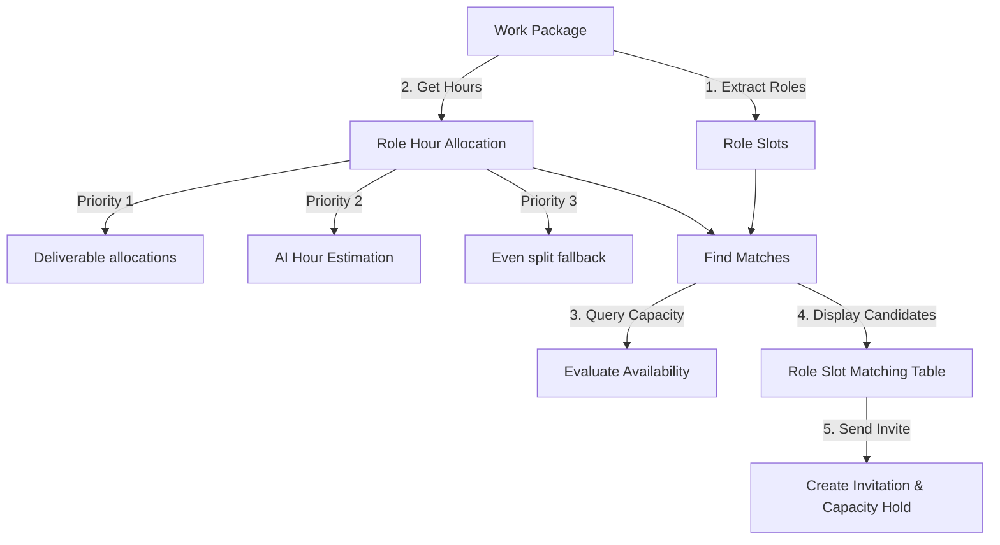

## 🗺️ The Matching and Hour Allocation Flow

Finding the right creative team requires evaluating calendar availability, hourly rates, technical skills, and experience. ABRAM automates this process through a unified matchmaking workflow.

---

## 1. Hours Allocation Priority Chain

Before matching candidates, the engine determines the effort hours required for each role slot using a priority chain:

1. **Deliverable Explicit Allocations (Priority 1 - Free)**: The system inspects individual deliverables linked to the work package. If you have explicitly assigned hours (e.g., *Lead Editor: 20 hours*, *VFX Artist: 10 hours*), these numbers are summed. This is the source of truth, requires no AI processing, and consumes no credits.
2. **AI Estimation (Priority 2 - Credit Gated)**: If no explicit allocations are declared, the AI Assistant analyzes the project scope to estimate role hours. To prevent duplicate charges, these estimates are automatically saved to the first deliverable in the project. Rerunning matches or loading the dashboard reads from this cached data at **$0 credit cost**.
3. **Even Split Fallback (Priority 3 - Free)**: If explicit and AI estimations are unavailable, the system divides the total work package hours evenly among the active roles (e.g., 30 hours split among 3 roles gets 10 hours each).

### Converting Effort Hours to Weekly Capacity
To check schedule availability, the total effort hours are converted into a weekly capacity hold:
* **Short Projects (1 week or less)**: The weekly capacity hold equals the total effort hours.
* **Long Projects (more than 1 week)**: The weekly capacity hold divides total hours by total weeks:
  $$\text{Weekly Capacity Hold} = \text{Math.round}(\text{Total Effort Hours} / \text{Total Project Weeks})$$

This value is stored as the `proposed hours per week` on the crew invitation.

---

## 2. Suitability Scoring Algorithm (0–100 Points)

Candidates are ranked and sorted in the **Role Slot Matching Table** using a composite score out of 100 points:

### A. Technical Skill & Expertise Fit (Up to 25 Points + Bonuses)
* **Skill Matching (15 pts)**: Compares required project skills with those declared on the freelancer's profile. Includes synonym mapping (e.g., matching "Premiere Pro" to "Adobe Premiere" automatically).
* **Software Proficiency (7 pts)**: Checks familiarity with required production software tools.
* **Role Alignment (3 pts)**: Confirms whether the freelancer's primary declared roles match the slot.
* **Equipment Matching (Up to 5 bonus pts)**: Awarded if the freelancer owns or operates specific technical equipment required for the shoot.
* **Specialization Bonus (Up to 15 bonus pts)**: Awarded if the freelancer holds verified specializations related to the project type (e.g., video editing, motion design).
* **Expertise Bonus (Up to 5 bonus pts)**: Awarded based on the freelancer's average expertise level in their verified skills.
* *Note: The overall matchmaking score is strictly capped at 100 points.*

### B. Location & Work Mode Fit
* **On-Site Roles**: The algorithm calculates geographic proximity between the freelancer’s declared home location and the shoot address to minimize travel, mileage, and hotel overhead.
* **Remote-Friendly Roles**: Location coordinates are ignored. The engine instead evaluates timezone overlapping to ensure smooth communications during collaborative windows.

### C. Real-Time Availability & Capacity (Up to 30 Points)
* **Live Schedule Query**: The algorithm queries all active bookings in the candidate's schedule for the project's exact date window.
* **Remaining Hours**: The system subtracts current project commitments from the freelancer's maximum weekly capacity. If the freelancer has enough free, unbooked hours to cover the role's weekly hours hold, they receive a perfect score. If they are overbooked, points are deducted.

### D. Budget Alignment (Up to 10 Points)
* **Rate Check**: Compares the freelancer's declared hourly or daily rate against the target budget allocated for that specific role slot.
* **Score Impact**: Freelancers whose rates fall within or below the budget range receive full points. If a freelancer's rate exceeds the target budget, points are deducted proportionally.

---

## 3. Scheduling & Calendar Booking Capacity Holds

To protect freelancer autonomy while maintaining accurate scheduling:

### Project Work Capacity Holds
* Once a freelancer accepts an invite, the booking is registered as a **Project Work Capacity Hold**.
* **Visual Representation**: The hold appears as an all-day block at the top of the freelancer's calendar rather than blocking off specific hours of the day. This indicates they are committed for a set number of hours that week (e.g., 10 hours), leaving them free to choose exactly when to perform the work.

### Syncing External Calendars
* ABRAM integrates with Google Calendar and Microsoft Outlook.
* **Events marked as "Busy"** on synced external calendars are automatically imported as blockouts, marking those hours as unavailable to producers.
* **Events marked as "Free" or "Tentative"** are ignored to prevent accidental calendar conflicts.

---

## 4. Chatbot Search & Fallback Behavior

Producers can search the talent network using normal language via the Platform Co-pilot (e.g., *"Find video editors in Chicago who are free next week"*).

### Constraint Relaxation
If search parameters are too restrictive and return zero results:
1. The chatbot dynamically relaxes filters rather than returning an empty page.
2. It first removes physical location filters to search remote-capable team members.
3. If still empty, it widens accepted roles.
4. Finally, it suggests top-rated creators with matching core skills.
5. The chatbot clearly explains how it adjusted the search parameters in the chat response.

### Chatbot Action Plans
Before dispatching any external invitation email, the chatbot generates a **Chatbot Action Plan** summary in the conversation panel outlining the candidate, role, rate, and hours. The action remains pending until the producer clicks the green **Approve** button, preventing accidental invitations.

---

## 5. Replacement Finder

If an invited freelancer declines a booking:
1. The **Replacement Finder** tool automatically runs a roster scan.
2. It lists alternative candidates with high match scores for that specific role slot.
3. The producer can click **Invite** to dispatch the backup offer immediately, minimizing delay.
