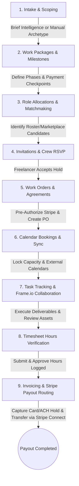

## What is ABRAM Network?

**ABRAM Network** is a comprehensive, AI-native production management and scheduling platform built specifically for modern creative studios, production agencies, and freelancers. It serves as a centralized operating system that connects project scoping, resource logistics, real-time crew scheduling, and secure financial payouts.

Unlike traditional generic project management tools that treat each project as a blank slate, ABRAM is built on a private knowledge engine (the **Company Brain** or **Workspace Memory**) that learns from past shoots, rates, roster history, and equipment logistics. By combining AI-driven brief scoping with granular availability matching, ABRAM helps creative teams execute productions on time and under budget.

---

## Core Pillars of the Platform

### 1. AI-Native Platform
ABRAM integrates artificial intelligence into the core workflows of production management:
* **Brief Intelligence**: Upload project briefs (PDF/Word) to automatically extract deliverables, timelines, roles, equipment requirements, and budget splits.
* **Smart Matchmaking**: Receive real-time matching suggestions for crew slots based on technical skills, location constraints, hourly rates, and live calendar availability.
* **Platform Co-pilot**: A conversational sidebar assistant capable of running talent searches, updating calendars, drafting work packages, and dispatching invitations.

### 2. Crew Management
Managing human resources is the most time-consuming part of any production. ABRAM automates:
* **Private Roster Directory**: Maintain a verified list of your internal staff and trusted external freelancers, complete with skill ratings, rates, and historical notes.
* **Unified Utilization Calendar**: Review team capacity at a glance. Detect overcommitments, tentative holds, and confirmed project hours.
* **External Calendar Sync**: Seamlessly sync availability in real time with Google Calendar and Microsoft Outlook to eliminate scheduling conflicts.

### 3. Production Infrastructure
Operational logistics require tight controls over physical assets:
* **Equipment & Kit Management**: Track hardware, cameras, and vehicle inventories. Group items into reusable kits that can be scheduled as a single unit.
* **Work Orders & Database Locks**: Enforce hard database constraints to prevent double-booking expensive physical gear.
* **Frame.io Review Workspace**: Automatically provision post-production folder hierarchies and pull presentation links and frame-by-frame review feedback directly into your project detail workspace.

---

## The Role Ecosystem

ABRAM tailors the interface and access permissions based on two primary roles:

| Role | Workflow Context | Primary Actions |
| :--- | :--- | :--- |
| **Producer** | Agencies, Studios, and Project Managers commissioning creative projects. | Uploading briefs, scoping work packages, booking equipment, inviting crew, approving timesheets, and authorizing payments. |
| **Freelancer / Crew** | Specialized creative talent (DPs, Directors, Editors, Designers). | Setting calendar availability, importing resumes, accepting/declining project invitations, logging timesheet hours, and routing payouts. |

---

## Visual Status Indicators

To keep teams aligned, ABRAM uses a standard, color-coded signaling system across schedules and financial dashboards:

* 🟢 **Green (Active / Confirmed)**: Indicates fully verified configurations (e.g., Stripe Active status, Confirmed crew/equipment bookings, and Active team members).
* 🟡 **Amber (Tentative / Pending)**: Indicates items awaiting action (e.g., Stripe "Setup Required" identity checks, Tentative project holds, or Pending invitations).
* 🔴 **Red (Conflict / Error)**: Indicates issues requiring immediate resolution (e.g., Double-booked equipment hard blocks, Overlapping calendar events, or Failed payment holds).
* 🔵 **Blue (Project Capacity Hold)**: Indicates blocked-out project work packages on a crew member's utilization calendar.

---

## Chronological Order of Operations

A project on ABRAM follows a structured sequence from initial intake through final financial settlement:

1. **Intake & Scoping**: Initialize projects via manual templates or through **Brief Intelligence** document parsing.
2. **Work Packages & Milestones**: Split projects into phases (Pre-Production, Production, Post-Production) and assign payment percentages to key checkpoints.
3. **Role Allocations & Matchmaking**: Define role slots, calculate weekly hours, and query the matchmaking engine for candidates.
4. **Invitations & Crew RSVP**: Send direct or Co-pilot invitations. Crew members review schedules and RSVP via secure links.
5. **Work Orders & Agreements**: Confirm booking dates, check for equipment double-bookings, and secure the producer's funds with a Stripe authorization hold.
6. **Calendar Bookings**: Sync the booking dates across internal utilization calendars and external Google/Outlook systems.
7. **Task Tracking & Collaboration**: Manage checklists and sync reviews through Frame.io.
8. **Timesheet Hours Verification**: Crew logs actual hours; project managers review and approve the time logs.
9. **Invoicing & Stripe Payout Routing**: Build PDF invoices, approve the Purchase Order, capture the authorized Stripe hold, and route payouts directly to the freelancer's bank account.
