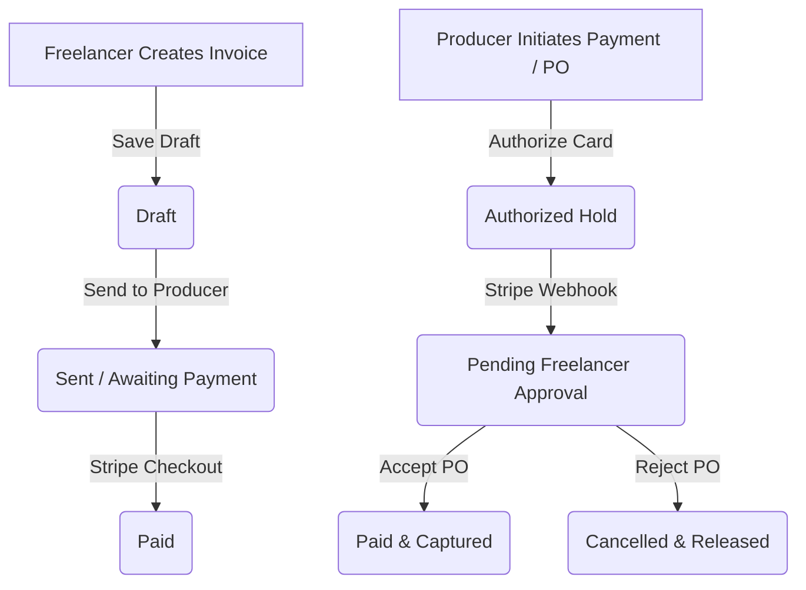

## 🗺️ Financial Lifecycle

ABRAM connects production budgets directly to freelancer payouts using a milestone-based billing ledger and Stripe Connect integration.

---

## 1. Stripe Connect Express Onboarding (Freelancers)

ABRAM uses Stripe Connect (Express) to securely distribute payments directly to freelancers. 

### Onboarding Steps:
1. Log in to your freelancer workspace and navigate to the **Financials** tab.
2. In the **Payout Setup** widget, click **Get Started**.
3. You will be redirected to the secure, Stripe-hosted onboarding portal.
4. Complete the verification form:
   * **Individual / Sole Proprietor**: Provide legal name, SSN (or tax ID), and DOB.
   * **Company (Studio/Agency)**: Provide legal entity name, EIN, and business address.
5. **Payout Destination**: Link your Bank Account (routing and account number) or a Debit Card.
6. Submit the form to return to ABRAM.

### Connect Account Statuses:
* 🟢 **Active**: Verification complete. You are ready to receive automatic payouts.
* 🟡 **In Review**: Stripe is checking your verification documents (usually takes 2–24 hours). Payouts are temporarily held in transit.
* 🟣 **Setup Required**: Onboarding is incomplete or failed. Click **Complete Setup** to finish the form or upload requested documents (e.g. photo ID).

*Note: Once active, you can click **Open Stripe Dashboard** to track payouts, manage cards, and download annual tax documents (such as Form 1099-NEC).*

---

## 2. Invoicing Lifecycle & Methods

ABRAM supports two primary methods for processing milestone and project payments:

### Method A: Freelancer Invoice Generation
1. In the **Financials** > **Invoices** tab, click **Create Invoice**.
2. **Configure Details**: Select the producer organization and link the active project.
3. **Autofill**: The builder automatically pre-populates line items with the project's contract rates and imports unbilled project expenses.
4. **Processing Fees**: The system calculates the subtotal and applies the standard **5% Platform Processing Fee**.
5. Click **Send Invoice**. The status updates to **Sent (Awaiting Payment)**, and the producer receives an email with a Stripe payment link.

### Method B: Producer Purchase Orders (POs)
1. In the **Financials** tab, click **Create Purchase Order**.
2. Select the freelancer to pay, enter the line items, and click **Authorize Payment**.
3. You will be redirected to Stripe Checkout to authorize the payment.
4. Stripe places an authorization hold on your card, and the invoice status in ABRAM shifts to **Pending Freelancer Approval**.
5. **Accept or Reject (Freelancer)**:
   * **Accept**: Triggers the capture service, transferring funds to your account. The invoice transitions to **Paid**.
   * **Reject**: Releases the card hold immediately, and the invoice transitions to **Cancelled**.

---

## 3. Stripe Authorization Holds (7-Day Expiration)

To guarantee funding before creative work begins, ABRAM utilizes Stripe's manual capture holds.

### The 7-Day Limit:
Stripe credit card authorizations expire naturally after **7 days**. Because production milestones often span longer, ABRAM's billing engine manages these holds automatically:
* **Silent Re-Authorization**: For work packages scheduled to take longer than 7 days, ABRAM sends a silent re-authorization request to Stripe on **day 6** to refresh the hold.
* **Failed Re-Authorizations**: If the re-authorization fails (e.g., card expired or limit reached), the project manager receives an email and in-app alert to update payment methods before work continues.
* **Hold Release**: If a project is cancelled or a milestone is rejected, the hold is immediately released, and the producer's credit line is restored.

---

## 4. Tracking and Transferring Payouts

Freelancers and studio organizations track their financial ledger in the **Payouts** tab:

### Balances:
* **Total Earnings**: Total value of all paid invoices since account creation.
* **Total Payouts**: Funds successfully transferred to your linked bank account.
* **Pending Balance**: Funds currently held by Stripe or in transit.
* **Available Balance**: Cleared funds ready for manual transfer.

### Requesting Payouts:
1. Under the **Payouts** tab, click **Request Payout**.
2. Enter the amount to transfer (minimum **$10.00**).
3. Confirm the transfer. Stripe Express will schedule the payout to your bank account or debit card.
