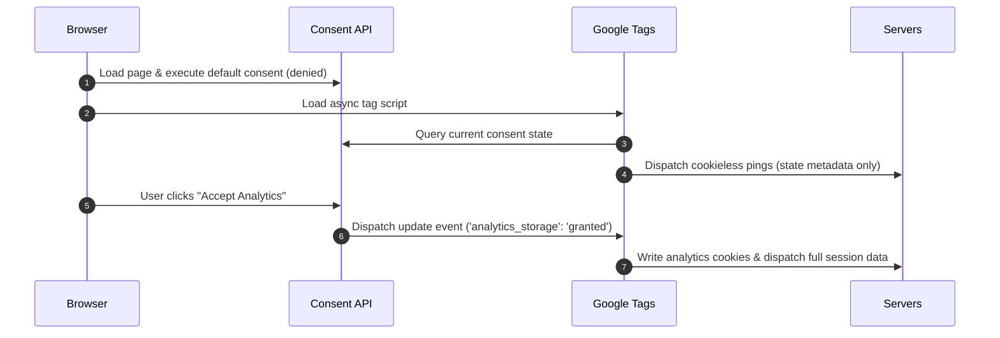

# Section 7.2: Cookie Consent and Tag Behavior

This article outlines how the ABRAM platform handles cookie consent, manages user preferences, integrates Google Consent Mode v2, and utilizes cookieless pings to balance accurate analytics with user privacy compliance.

---

## 1. Consent State and Tag Behavior

The platform utilizes a dynamic consent framework that respects user privacy preferences by adjusting the behavior of measurement tags in real time. Rather than blocking tags from loading entirely, the platform loads tags in all cases and manages their capabilities via two primary consent states:

*   **`ad_storage`**: Controls the storage (such as cookies) related to advertising.
*   **`analytics_storage`**: Controls the storage (such as cookies) related to analytics and site usage.

Depending on the consent state, tag behavior adjusts as follows:

| Consent Parameter | State | Tag Behavior & Data Collection |
| :--- | :--- | :--- |
| **`ad_storage`** | `granted` | Advertising cookies are read and written. Full conversion tracking, audience building, and remarketing capabilities are enabled. |
| | `denied` | Advertising cookies are blocked. Tags do not read or write advertising-related cookies. Instead, cookieless pings are sent to report basic ad performance and conversion metrics. |
| **`analytics_storage`** | `granted` | Analytics cookies are read and written. Full session tracking, page-view journeys, and user behavior analytics are recorded. |
| | `denied` | Analytics cookies are blocked. Tags do not read or write analytics cookies. The system sends cookieless pings containing basic operational parameters. |

---

## 2. Ad Storage Denied: Redaction vs. Redaction Disabled

When a user denies consent for advertising cookies (`ad_storage='denied'`), the platform can handle data transmission in two distinct modes depending on compliance settings:

### Redaction Disabled (`ads_data_redaction='false'`)
When ad data redaction is disabled and `ad_storage` is `denied`:
*   The system blocks the creation and reading of advertising cookies.
*   The tag continues to send cookieless pings to measure conversions.
*   Ad click identifiers (such as query parameters in URLs) are still sent to help attribute the click event to a campaign.

### Redaction Enabled (`ads_data_redaction='true'`)
When ad data redaction is enabled and `ad_storage` is `denied`:
*   The system blocks all advertising cookies.
*   All ad click identifiers (such as ad-click query parameters) are stripped or redacted from the URL and payload before sending.
*   The cookieless pings sent to the server contain no identifiers that could link the interaction to a specific ad click, ensuring maximum privacy compliance under strict regional laws.

---

## 3. Cookieless Pings and Data Collection

Cookieless pings are secure, stateless network requests sent to measurement servers when a user has denied cookie consent. They do not store, access, or read any cookies or local identifiers on the user's browser, preventing the creation of a persistent profile.

These pings carry essential, coarse-level metadata to ensure basic reporting remains functional:

*   **Functional Information**: User agent (browser type, OS version, device type) and screen resolution.
*   **Timestamp**: The exact time of the event.
*   **Coarse Location Info**: Regional/country data derived from the user's IP address (the IP address itself is processed in memory and discarded; it is never written to disk or stored).
*   **Referrer**: The page URL that led the user to the current page.
*   **Random Page-Navigation ID**: A temporary, random ID generated for each page view. This links events occurring within the same page load (e.g., a page view and a button click) but cannot track the user across different pages or sessions.
*   **Consent State**: Verification metadata detailing that consent was explicitly denied.

---

## 4. Regional Defaults and Measurement Strategy

To preserve analytical integrity without violating privacy regulations, the platform dynamically configures consent defaults based on the visitor’s geographic region:

*   **Strict Opt-In Regions (EEA, UK, Switzerland)**: By default, `ad_storage` and `analytics_storage` are set to `denied` before any tag executes. Tags only activate fully when the user explicitly grants permission through the consent banner.
*   **Opt-Out Regions (Rest of the World)**: By default, `ad_storage` and `analytics_storage` are set to `granted`. Users can opt out or modify their preferences at any time via their cookie settings.

> [!NOTE]
> Setting defaults dynamically by region allows the platform to maintain compliant tracking workflows globally without sacrificing measurement accuracy in regions with opt-out regulations.

---

## 5. Implementation Best Practices

To ensure correct consent management across your workspace pages, adhere to the following best practices:

1.  **Load Tags in All Cases**: Do not use conditional logic to prevent tag scripts from loading. Instead, load the tag scripts on all page views. The tags themselves will read the consent state and dynamically adjust their behavior.
2.  **Define Defaults Early**: Set default consent states (such as `denied` for EEA visitors) at the very top of the page header, before any Google Analytics or advertising scripts are parsed or loaded.
3.  **Update State Instantly**: When a user selects their preferences in the consent banner, update the consent state immediately using the update API. Tags will immediately adjust and process any queued events according to the new consent values.
4.  **Understand Advanced vs. Basic Consent**:
    *   **Advanced Consent (Recommended)**: Loads scripts immediately with `denied` defaults. When users deny consent, tags adapt to send cookieless pings, enabling conversion modeling and basic metrics.
    *   **Basic Consent**: Blocks tag scripts from loading until the user explicitly clicks "Accept". This prevents any data transmission, including cookieless pings, resulting in a complete loss of measurement for non-consenting users.

---

<AgentOnly>

## 🤖 Agent Operations & System Rules

This technical section defines the programmatic script configuration, initialization sequences, and consent state updates for LLM-based crawlers and automated verification systems.

### 1. Default Script Configuration (Gtag.js Syntax)

The platform implements Google Consent Mode v2 via the following script sequence in the document `<head>`:

```html
<!-- Initialize the data layer -->
<script>
  window.dataLayer = window.dataLayer || [];
  function gtag(){dataLayer.push(arguments);}

  // 1. Set default consent state (e.g., for EEA/UK regions)
  gtag('consent', 'default', {
    'ad_storage': 'denied',
    'analytics_storage': 'denied',
    'ad_user_data': 'denied',
    'ad_personalization': 'denied',
    'wait_for_update': 500
  });
  
  // 2. Set ads data redaction behavior
  gtag('set', 'ads_data_redaction', true);
</script>

<!-- Load Google Tag Manager / Global Site Tag -->
<script async src="https://www.googletagmanager.com/gtag/js?id=G-XXXXXXXXXX"></script>
<script>
  gtag('js', new Date());
  gtag('config', 'G-XXXXXXXXXX');
</script>
```

### 2. User Consent Update Workflow

When a user interacts with the UI consent banner and selects their choices, the application dispatches an update command:

```javascript
// Example: User grants analytics consent but denies ad consent
gtag('consent', 'update', {
  'ad_storage': 'denied',
  'analytics_storage': 'granted',
  'ad_user_data': 'denied',
  'ad_personalization': 'denied'
});
```

### 3. Event Execution Order

To prevent race conditions, the platform enforces the following lifecycle steps:



### 4. Technical Validation Checklist
*   Verify that `gtag('consent', 'default', ...)` is executed before the main tracking script tag loads.
*   Confirm that the `wait_for_update` parameter is defined, allowing custom scripts up to 500ms to resolve initial consent state before firing tags.
*   Ensure that no local storage items or cookies are created under domains when consent is in a `denied` state.

</AgentOnly>
